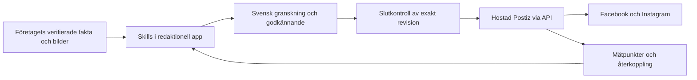

# Social Media Skills + Postiz jämfört med Brightbean

**Rekommendation: välj användarens kombination med hostad Postiz om målet är mindre integrations- och driftarbete. Välj Brightbean om hela plattformen ska drivas av oss utan Docker och en separat publiceringstjänst inte är önskvärd.** Det är två olika driftbeslut; det ena är inte bäst under alla förutsättningar.

Denna rekommendation ersätter Brightbean som huvudval i den första analysen. Den [fullständiga projektplanen](../superpowers/plans/2026-09-07-social-content-engine.md) har uppdaterats till Postiz-spåret.

## Vad de två byggblocken ger

`social-media-skills/skills` ger instruktioner och metoder för företag, tonalitet, ämnen, idéer och produktion. Det är ett MIT-paket med Markdown och referenser, inte en server som redan lagrar företag, kontrollerar fakta och lär sig av publicering. Vi väljer relevanta delar och kör dem med företagsspecifik kontext. [Repository](https://github.com/social-media-skills/skills).

Postiz har dokumenterat stöd för att lista anslutna konton, skapa utkast, schemalägga/publicera och läsa resultat på konto- och postnivå. Det passar som extern publiceringsmotor. Stöd i dokumentationen är inte samma sak som verifierat innehåll i API-svaren för våra sex anslutningar. [API](https://docs.postiz.com/public-api/introduction), [konton](https://docs.postiz.com/public-api/integrations/list), [publicering](https://docs.postiz.com/public-api/posts/create), [postresultat](https://docs.postiz.com/public-api/analytics/post).

Det som fortfarande behöver byggas är den sammanhängande redaktionella funktionen: aktuell företagskunskap, faktagiltighet, riktig tonalitet, rättighetsstyrt bildval, svensk arbetslista, mänskligt godkännande och spårbar återkoppling. Det är den största produktdelen och bör inte beskrivas som några enkla kopplingar mellan två repon.

## Praktisk jämförelse

| Kriterium | Skills + hostad Postiz | Skills + egen Postiz | Skills + Brightbean-fork |
|---|---|---|---|
| Publiceringsplattformens drift | Leverantörens ansvar | Vårt ansvar, flera infrastrukturtjänster | Vårt ansvar, enklare native stack |
| Befintlig färdig produktkod i vårt eget UI | Begränsad; vi bygger en avgränsad redaktionell app | Postiz UI finns men är bredare än behovet | Stor återanvändning, men behöver förenklas och översättas |
| Vårt arbete utan Docker | Ja för egen app; Postiz är extern tjänst | Möjligt i princip, större native-installation måste bevisas | Native utveckling dokumenterad; produktionskonfiguration måste anpassas |
| Ändringar i publiceringskärnan | Inga; API-avtal | Risk att behöva följa intern kod och uppdateringar | Egna kontroller i forken måste underhållas |
| Kontroll precis före leverans | Vår kontroll före API-överlämning; begränsad efter överlämning | Kan utökas i egen fork men ökar underhåll | Kan integreras direkt i samma publiceringsprocess |
| Grundens kända svaghet | Extern tjänst, åtkomstmodell och API-täckning måste provas | PostgreSQL + Redis + Temporal och mer drift | Granskad revision binder Django 5.1 som saknar support |
| Löpande tjänsteavgift | Team listas för 39 USD/månad | Egen drift, eventuella tjänster tillkommer | Egen drift och underhåll |
| Mitt val | **Förstahandsval för liten manuell/teknisk belastning** | Inte förstahandsval för tre företag och Dockerfri drift | **Reserv när egen samlad drift är viktigast** |

Postiz Team har tio kanaler och API enligt [prissidan](https://postiz.com/pricing). Sex kanaler täcker tre FB/IG-par om de ryms i samma abonnemangsorganisation. Postiz kundgrupper är inte verifierade som separata behörighetsgränser. Ett krav på separata organisationer/nycklar kan kräva en annan abonnemangskalkyl.

Postiz infrastruktur bedöms från den granskade [Compose-konfigurationen](https://github.com/gitroomhq/postiz-app/blob/36d5fc7b3ac3f17178b1589cf7a7337523017a41/docker-compose.dev.yaml). Brightbeans Django-begränsning finns i dess [requirements](https://github.com/brightbeanxyz/brightbean-studio/blob/d85fce192e687d20e8fd7e9449a40ad7952ec7c3/requirements.txt); supportläget är kontrollerat mot [Django](https://www.djangoproject.com/download/). Inget av projekten har körts lokalt i denna planeringsuppgift.

## Rekommenderad koppling

Postiz sköter kontoanslutningen och den faktiska leveransen. Vår app behåller originalmaterial, företagssanning och godkännandet. Bara godkända kanalversioner får nå ett publicerande API-anrop. Att en generell AI-agent har Postiz API-nyckeln är inte ett acceptabelt godkännandeflöde.

Veckans plan ligger lokalt fram till slutkontroll. Därefter lämnas respektive kanalversion till Postiz. Långsiktig schemaläggning direkt i Postiz aktiveras först om återkallelse vid ändrade fakta kan hanteras med tydliga garantier och begränsningar. Detta undviker ett påstående om att lokalt pausade inlägg automatiskt är pausade i en extern publiceringskö.

## Första provet som måste lyckas

1. Anslut ett riktigt företags Facebook och Instagram genom Postiz; kontrollera att integrationernas ID och visade kontoägare stämmer.
2. Spara ett API-utkast och bevisa att det inte publiceras. Skicka därefter ett uttryckligen godkänt testinlägg och verifiera rätt text, riktig bild och rätt konto på båda plattformarna.
3. Prova avbrott: timeout efter accepterat API-anrop, återförsök, ett konto frånkopplat samt en kanal som lyckas medan den andra misslyckas. Okänt resultat får inte leda till en blind dubbelpublicering.
4. Prova framtida schemaläggning och avbrytande separat. Bevisa vad som händer om återkallelsen är för sen. Detta påverkar om framtida schemaläggning i Postiz kan användas för tidskänsligt innehåll.
5. Läs tillbaka post-ID/permalink och faktiska resultatfält. Dokumentera vilken tidpunkt värdet avser och vilka mått som saknas; ett fält med namnet ”Views” är inte tillräcklig definition.
6. Kontrollera företagskopplingar, API-nycklarnas räckvidd, mediernas sekretess, kontoavgifter och dataavtal. Skapa inte ett nytt abonnemang eller anslut produktionskonton som en del av denna planeringsleverans.

Om provet lyckas är kombinationen en starkare grund för projektets mål än att börja underhålla en egen publiceringsplattform. Det bevisar fortfarande inte att 80 % av idéerna blir relevanta; det kräver Gullbringa-piloten med riktiga texter, bilder och redaktionella beslut.
