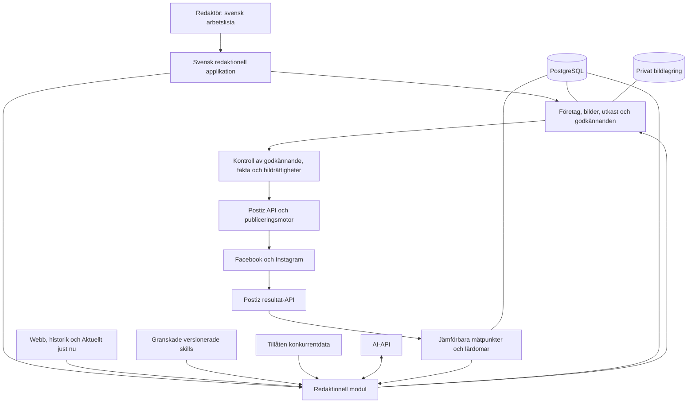

> HISTORISKT UNDERLAG: Tidslinje och byggordning är ersatta för första versionen. Se [aktuell leverans i timmar](../../2026-09-07-forsta-version.md).

# Social Content Engine – fullständig projektplan

> **For agentic workers:** REQUIRED SUB-SKILL: Use superpowers:executing-plans to implement this plan task-by-task. Steps use checkbox (`- [ ]`) syntax for tracking.

**Goal:** En person ska kunna förbereda och godkänna en veckas relevant, faktastött Facebook- och Instagraminnehåll för vart och ett av tre företag på ungefär 15–20 minuter per företag.

**Architecture:** Kombinera `social-media-skills/skills` med Postiz via dess publika API. Skills styr det redaktionella arbetet i en svensk applikation som äger företagskunskap, bildrättigheter, utkast och godkännanden; hostad Postiz sköter sociala anslutningar, leverans och resultathämtning. Brightbean är reserv om egen native drift av hela lösningen prioriteras framför en mindre tjänsteavgift.

**Tech Stack:** Python 3.12, Django 5.2 LTS, Django-templates/HTMX, PostgreSQL, Django Q2 med ORM-broker, S3-kompatibel bildlagring, OpenAI Python SDK och Postiz Public API. Vanliga ramverksfunktioner återanvänds för inloggning, formulär och administration.

**Spec:** [Ursprungligt underlag med 43 kravområden](../../specs/2026-09-07-ursprungligt-underlag.md). Användarens tillägg 2026-09-07: prioritera färdiga repon som går att kombinera för att förenkla bygget och minska osäkerheten.

## Globala krav

- ”Allt användargränssnitt ska vara på svenska.”
- ”Information från företag A får inte råka påverka företag B.”
- ”riktiga bilder från företaget först.”
- ”Initialt ska inget publiceras helt autonomt.”
- ”Lösningen ska kunna köras utan Docker.”
- ”Hemligheter får aldrig committas till Git.”
- ”0 publicerade hallucinationer om företagets fakta.” Detta är ett kvalitetsmål och en incidentgräns, inte en möjlig generell AI-garanti.
- Initialt tre företag, Facebook och Instagram; Gullbringa är första referensföretaget.
- Mänskligt godkännande gäller exakt den text, bild, kanal och tid som ska publiceras.
- Företagsdata, konton och budget är ännu inte tillhandahållna. Exempel i planen är testfall, inte verifierade aktuella Gullbringa-uppgifter.

---

## 1. Beslutet: två huvudbyggblock och en redaktionell applikation

Rekommendationen efter jämförelsen är **social-media-skills/skills + hostad Postiz**, sammanbundna av en avgränsad svensk redaktionell applikation. Detta följer önskemålet att prioritera färdiga delar och minskar vårt ansvar för löpande Meta-integrationer. Det är inte en färdig två-repo-installation: faktamodell, bildrättigheter, enkel svensk UX och lärande behöver fortfarande byggas.

| Del | Befintligt bygge | Vad vi gör |
|---|---|---|
| Sociala konton, kanalregler, leverans, drift av publiceringsjobb och resultat-API | Postiz | Använd hostad tjänst via dokumenterat API. Ingen Postiz-fork eller egen Meta-adapter i första versionen. |
| Företagsprofil, innehållsområden, idéarbete, captions och kanalanpassning | social-media-skills/skills | Lägg ett granskat urval av MIT-instruktioner i repo med låst ursprung. |
| Verklig tonalitet, content-matris och Reel-struktur | charlie947/social-media-skills, komplettering vid behov | Använd endast de metoder som förbättrar pilotresultatet utöver huvudpaketet. |
| Konkurrentanalys | Prodkit som referens och begränsat kodurval | Lägg till efter första fungerande innehållskedjan. Det är inte en tredje driftplattform. |
| Företag, faktakällor, bilder/rättigheter, svenska godkännanden och återkoppling | Egen redaktionell Django-applikation | Återanvänd ramverksfunktioner, håll en egen sanningskälla och anropa Postiz först efter våra kontroller. |

Den detaljerade [repogranskningen](../../research/2026-09-07-repogranskning.md) redovisar alla tio alternativ, licenser, revisioner och kodfynd.

Postiz Team listas för 39 USD/månad och tio kanaler; sex kanalanslutningar räcker för tre Facebook-sidor och tre Instagramkonton. Det gäller en gemensam Postiz-organisation; separat abonnemang per företag eller andra kontoavtal kan ändra kostnaden. Inget abonnemang är tecknat. [Pris och funktioner](https://postiz.com/pricing).

Valet gäller **hostad Postiz**. Egen Postiz-drift innebär PostgreSQL, Redis, Temporal och fler processer. Om kravet betyder att även publiceringsplattformen ska drivas av oss utan Docker väljer jag hellre Brightbean, efter dess grundbevis. [Jämförelsen mellan alternativen](../../research/2026-09-07-postiz-jamforelse.md).

## 2. Varför projektet kan misslyckas

**Det dyraste obevisade antagandet är att företagens befintliga information, bilder och historik räcker för bra förslag med mycket liten löpande redaktionell insats.** En färdig scheduler löser inte att uppdaterade priser saknas, att bildrättigheter är oklara eller att ingen dokumenterar vad som händer i verksamheten.

Den starkaste invändningen mot hela idén är därför att motorn kan skapa mer granskningsarbete än den sparar. Det måste mätas med riktiga förslag och faktisk arbetstid, tidigt.

| Risk | Tidigt bevis | Åtgärd och stoppregel |
|---|---|---|
| Företagsinformationen är för gammal eller otillräcklig | Försök skapa 30 idéer och 12 färdiga inlägg för Gullbringa | Om mindre än 80 % av idéerna är relevanta: förbättra underlaget och urvalet innan mer automation byggs. |
| Granskning tar för lång tid | Klocka hela veckoarbetet inklusive rättelser och informationsinmatning | Över 20 minuter efter intrimning: minska förslagsmängden och rätta orsaken till omarbetning. |
| Postiz API räcker inte för hela det kontrollerade flödet | Skapa, läsa, publicera, avbryta och hämta verkliga mätvärden för FB/IG | Högst 5 utvecklingsdagar för grundbevis. Stoppa beroende bygge om publiceringsutfall eller nödvändiga data inte går att verifiera. |
| Metaåtkomst saknas eller formatstödet skiljer sig mellan konton | Anslut ett riktigt företagspar och dokumentera behörigheter, mediaformat och läsning av resultat | Kontoägarskap/appgranskning startas direkt. Manuellt publiceringspaket är reserv, inte bevis på automatiserad publicering. |
| Konkurrentdata saknas eller är inte tillåten att samla in | Kontrollera åtkomst och datafält för tre relevanta konkurrenter | Begränsa bevakningen till dokumenterat tillgängliga källor och visa täckningen. Hela kärnan får inte bero på en scraper. |
| Historiken är för liten för säkra slutsatser | Räkna jämförbara egna inlägg per format och mättid | Visa ”För lite underlag”. Undvik automatiska viktändringar utifrån några få vinnare. |
| Färdiga funktioner ökar komplexiteten i gränssnittet | Femminuterstest med nya personer | Bygg en enkel arbetslista ovanpå befintliga tjänster. Funktioner utanför uppdraget ska inte vara åtkomliga i redaktörsflödet. |

## 3. Vad som ingår i första fullständiga versionen

En fullständig V1 omfattar samtliga centrala krav: tre separata företag, aktuellt företagsunderlag, verklig tonalitet, bilder med rättigheter, idéer före text, kanalanpassade inlägg, mänskligt godkännande, schemaläggning/publicering och en återkoppling från resultat till nya förslag.

Första användbara pilot levererar bildinlägg till Facebook och Instagram. V1 utökas sedan med carousels, uppladdade färdiga Reels, Reel-manus och Story-förslag. Faktisk automatisk publicering av varje format får bara aktiveras efter prov på den aktuella kontotypen. Story-idéer eller ett manus är inte samma sak som producerad och publicerad video.

| Format | Produktion | Publicering |
|---|---|---|
| Facebook text/länk/bild | Text, fakta, riktig bild och kanalversion | Via Postiz efter konto- och formatprov. |
| Instagram bild | Caption, alt-text, riktig bild och kontrollerad beskärning | Via Postiz efter prov av uppladdning och faktisk publicering. |
| Carousel | Struktur, texter och verkliga bilder eller enkel mallgrafik | Efter separat prov av ordning, bildantal, beskärning och caption. |
| Reel | Manus, shot list, undertexter/brief och förslag på verkligt material | Färdig uppladdad video; ingen egen fullständig videoredigerare. |
| Story | Idé, text och vald bild/film | Automatisk när konto och format stöds; annars tydligt exportpaket med manuell kvittens. |
| AI-grafik | Illustration, bakgrund eller tydligt konceptmaterial | Kräver mänsklig kontroll. Ska inte framställas som foto av verklig verksamhet. |

DM-inbox, annonser, CRM, influencerhantering, full bild/videoeditor, mobilapp och andra nätverk ingår inte. Redaktionella användare arbetar i den svenska applikationen. Postiz är anslutnings- och driftverktyg för administratören. Dess AI-autopublicering och andra automatiska innehållsflöden aktiveras inte för dessa konton.

## 4. Arkitektur och ägarskap

### Tydliga dataägare

Vår app äger företag, källor, fakta, originalbilder, idéer, redaktionella revisioner, mänskliga beslut och avsedd publiceringstid. Postiz äger sociala anslutningar, sin leveranskö, externa publicerings-ID:n och hämtning av plattformsresultat. Lokalt lagras Postiz-ID och faktisk leveransstatus som spegling; de konkurrerar inte med en andra egen Meta-publiceringsmotor.

Varje företag har en egen obligatorisk företagsidentitet. Samma användare kan ha medlemskap i alla tre. Postiz integration-ID:n binds på servern till exakt ett företag och kontrolleras inför varje anrop. Postiz kundgrupper används för administration och får inte räknas som en bevisad säkerhetsgräns. Första planen kan ha en gemensam Postiz-organisation för den behöriga operatören; om separata nycklar/organisationer krävs måste detta provas och prissättas före drift. Företagskunskap och bildsökning delas aldrig.

### Föreslagen drift

- Render native Python webbtjänst och kontinuerlig bakgrundsprocess, i samma europeiska region som databasen.
- Hanterad PostgreSQL; PostgreSQL används även i integrationstester. SQLite kan användas för en enkel första start men godkänner inte samtidighet eller drift.
- Cloudflare R2 eller motsvarande S3-kompatibel lagring via ett färdigt Django storage-bibliotek. Välj och verifiera EU-jurisdiktion vid skapandet; ett placeringsönskemål är inte samma sak som ett avtalskrav på dataplacering.
- Django Q2 med PostgreSQL/ORM-broker för insamling, generering, slutkontroll och statusavstämning. Det är ett färdigt köbibliotek, inte en egen broker. Native Windows- och Linux-start provas i etapp 0. [Q2 och ORM-broker](https://django-q2.readthedocs.io/en/master/brokers.html).
- Ingen egen Redis-, pg-boss-, Temporal- eller n8n-drift. Postiz driver sin egen infrastruktur. Kravet utan Docker avser vårt utvecklings- och driftarbete; vi förutsätter inte hur en extern tjänsts interna miljö är byggd.
- Python-venv och vanliga processer lokalt. Undvik en separat frontendapplikation; Node behövs bara om valda statiska byggverktyg kräver det.
- Bildlagring ska överleva driftsättning. Metahämtning får tidsbegränsad tillgång till en publiceringsvariant; originalbiblioteket är privat.

Native Django-drift är dokumenterad av [Render](https://render.com/docs/deploy-django), men vår app måste själv klara native-bygg och omstarter. Automatisk avancerad videobearbetning väljs bort i första leveransen; färdig video skickas till Postiz.

### Hur återanvändningen hålls underhållbar

Ett eget litet produktrepo med versionslåsta återanvända skills och vanliga bibliotek. Postiz anropas via en adapter med kontraktstester mot dess publika API. Vi skriver inte direkt till Postiz databas och kopierar inte dess publiceringsmotor till vår kod.

Skill- och biblioteksuppdateringar tas in via granskade ändringar och tester. Bevara MIT-attribution och låst revision. Postiz AGPL och villkor måste hanteras om vi senare modifierar/distribuerar dess kod; vanlig användning av den hostade tjänstens HTTP-API ska inte förväxlas med att forka dess programvara. Tjänstevillkor och dataavtal gäller fortfarande. [Repogranskning](../../research/2026-09-07-repogranskning.md).

## 5. Användarens arbetsflöde

Huvudnavigation: **Översikt · Innehållsförslag · Bilder · Aktuellt just nu · Resultat**. Under företagets inställningar finns **Om företaget · Konkurrenter · Anslutna konton**. Kalender och Publicerat är vyer inom arbetsflödet, inte ytterligare stora verktyg.

Startsidan visar det aktiva företagets namn hela tiden. På översikten står exempelvis:

> Gullbringa Golf  
> 5 inlägg är klara att godkänna  
> 1 inlägg saknar bild  
> 1 uppgift behöver kontrolleras

Varje förslag visar format, kanalversioner, tänkt publiceringstid, bild och text. ”Varför föreslås detta?” ger högst tre konkreta skäl. ”Kontrollerade uppgifter” går att öppna för källa och giltighet.

Primära handlingar: **Godkänn · Ändra · Byt bild · Nej tack**. Förslag som saknar verifierat pris eller rätt bild går inte att godkänna. Förklaringen säger vad som behöver göras: ”Priset behöver bekräftas”, inte en felkod.

”Godkänn veckan” visas först när varje ingående kanalversion är granskningsklar. Bekräftelsen visar företag, antal inlägg och datum. Innehåll som ändras eller blir inaktuellt efteråt kräver nytt godkännande.

### Aktuellt just nu

Användaren skriver exempelvis ”Vi har fått nya rangebollar idag. Bilder kommer senare.” Systemet föreslår en tydlig tolkning: ämne, datum, hur länge nyheten är relevant och om bild saknas. Vanliga nyheter kan sparas direkt med lätt ändringsbar relevanstid. Pris, datum, erbjudande och öppettider som ska bli publiceringsbara visas med de konkreta värden som ansvarig person behöver bekräfta.

”Gäller tills vidare” betyder inte verifierad för alltid. Fakta kan behöva återkontrolleras före framtida publicering. Relativa uttryck som ”idag” lagras med kalenderdatum och företagets tidszon; de återanvänds inte ordagrant en vecka senare.

### Delegationstest

Fem personer som inte byggt systemet får fem minuter var och följande uppgifter: hitta rätt företag, se vad som behöver göras, ändra text, byta bild, godkänna, avslå, lägga till en nyhet och hitta vad som fungerat bäst. Minst fyra av fem ska klara hela uppsättningen utan handledning. Ingen får oavsiktligt publicera för fel företag. Det är ett pilotkriterium, inte statistiskt bevis för alla framtida användare.

## 6. Onboarding och databehov

Företagsägaren lämnar namn, egna webb- och sociala adresser, mål, prioriterade erbjudanden, ämnen som ska undvikas och en person som kan bekräfta fakta. Gullbringa används först; övriga företag namnges och mappas när uppgifterna finns.

Systemet samlar därefter in eller importerar:

- 6–12 månaders egna posts och resultat när export/API tillåter det. Minst 30 texter är ett arbetsmål; färre fungerar för första försöket men ger större osäkerhet.
- 10–20 representativa texter för tonalitet samt några godkända exempel på vad företaget gillar och ogillar.
- 50–100 riktiga bilder om de finns, med rättighetsstatus och ägare. Färre bilder får inte ersättas med påhittade verksamhetsfoton.
- Auktoritativa sidor för priser, event, kontakt, öppettider och verksamhet; för Gullbringa även exempelvis bana, Academy, juniorer och restaurang när de är relevanta.
- 3–5 konkurrentkonton och skälet till varför vart och ett är relevant.

Onboarding består av sex korta moment: välj företag, anslut konton, lägg till källor, välj textexempel, lägg in bilder och kontrollera profilförslaget. Mål för första manuella etablering: 1–3 timmar per företag, utöver arbete att reda ut saknad historik eller rättigheter. Detta räknas separat från den löpande veckotiden.

Historiska sociala posts är i första hand stil- och historikmaterial. Ett pris i ett gammalt inlägg får aldrig uppgraderas till aktuell företagsfakta enbart för att posten importerats idag.

## 7. Företagskunskap och faktakontroll

### Två sorters tid och två sorters information

Varje källversion sparar när innehållet hämtades och vad sidan faktiskt innehöll. Varje faktaversion sparar när uppgiften gäller. En källa hämtad idag kan beskriva ett evenemang som avslutades för ett år sedan.

Företagsprofilen innehåller mål, målgrupp, positionering och tonalitet. Ett separat faktaregister innehåller publiceringsbara påståenden med källa, giltighet, kontrollstatus och ansvarig person. Textsökning eller embeddings hittar relevant material; de avgör inte själva om materialet är sant eller aktuellt.

| Fält | Betydelse |
|---|---|
| företag/arbetsområde | Ägare till informationen och enda tillåtna kontext. |
| faktanyckel och värde | Exempelvis ett namngivet pris med valuta, produkt, målgrupp och villkor. |
| giltig från/till | Period då uppgiften får användas; kan skilja sig från publiceringsdatum. |
| registrerad/hämtad/kontrollerad | När systemet fick veta eller bekräftade informationen. |
| källversion och utdrag | Exakt stöd, URL eller mänsklig bekräftelse med tid och användare. |
| kontrollstatus | Föreslagen, bekräftad, motstridig, utgången eller ersatt. |
| ersätter | Spårbar relation till tidigare faktaversion. |

Källprioritet sätts **per uppgift**. Prislistan är normalt auktoritet för pris, tävlingssidan för tävlingsdatum och ansvarig verksamhetsperson för en nyhet som ännu inte publicerats på webben. ”Nyast hämtad vinner” är ingen generell regel. Motstridiga giltiga uppgifter stoppar det berörda påståendet.

### Kontroll före text, efter text och före publicering

1. Välj endast fakta som gäller för avsedd publicering och erbjudande-/eventperiod.
2. Ge skribenten ett litet paket med tillåtna faktaversioner. Håll äldre stilexempel separat och markera dem som stil, inte fakta.
3. Kräv ett strukturerat register över påståenden och deras källreferenser i utkastet.
4. Kontrollera priser, datum, namn, siffror och villkor mot det faktiska registret med vanlig kod. En separat AI-granskning kan hitta semantiska problem men är inget sanningsbevis.
5. Visa kvarstående osäkerhet. Användaren kan ta bort påståendet eller bekräfta det med ansvar och giltighet; en generell ”publicera ändå”-knapp ska inte kringgå kritiska fakta.
6. Kör om relevanta kontroller vid text- eller bildändring och omedelbart före extern publicering. Även mänskligt skrivna rättelser kontrolleras.

Startvärden för återkontroll: banstatus/tillfälliga öppettider inom 24 timmar och nära planerad publicering; kampanj, event och pris inom 24 timmar före publicering samt om källan ändrats; mer varaktig profilinformation var 90:e dag. De är konfigurerbara produktregler, inte bevis för att en sida som inte ändrats måste vara korrekt. Misslyckad hämtning förlänger inte giltighet.

Alla publicerbara faktapåståenden kräver stöd. Om motorn missar ett påstående eller själva auktoritativa källan är fel kan ett sakfel ändå uppstå. Därför mäts blockerade fel, fel funna av människa och faktiskt publicerade fel separat. Ett publicerat fel utlöser paus av berörda kommande inlägg och en konkret rättelseprocess.

## 8. Bilder, rättigheter och grafisk produktion

Använd färdiga bibliotek för säker uppladdning, lagring, bildmetadata och beskärning. Postiz får den valda publiceringsfilen; vår app behåller originalbibliotek och rättigheter. Komplettera varje bild med motiv, miljö, säsong, orientering, kvalitet, användningshistorik och ursprung. Identifiera inte personer genom ansiktsigenkänning; namn kan läggas till av en människa. Att en bild föreställer barn eller kan behöva samtycke är en granskningssignal, aldrig bevis för att rättighet finns.

Rättighetsposten skiljer på användning i sociala medier och annonser, fotograf/avtal, eventuella samtycken, sista giltighetstid och återkallad rättighet. Okända eller utgångna rättigheter spärrar automatisk rekommendation och publicering. Datum kontrolleras mot publiceringstid, inte bara uppladdningstid.

Urvalet görs i ordning: tillåten användning → rätt företag → relevant motiv och säsong → format och beskärning → variation mot nyligen använda bilder. Användaren får tre förslag, inte hela bildbiblioteket.

En bild på en golfbana får inte automatiskt bli bevis på Gullbringas aktuella banstatus. En fotografisk AI-bild får inte användas för att representera verkliga lokaler, produkter eller personer. AI lämpar sig för illustrationer och konceptgrafik. För kampanjmallar läggs verifierade priser/datum som deterministisk text ovanpå grafiken, i stället för att låta bildmodellen rita kritiska faktauppgifter.

Genererat material märks internt med modell, instruktion, tid och avsett användningssätt. Om bilden riskerar att missförstås av publiken används tydlig märkning eller en annan bild. Alt-text och läsbarhet kontrolleras även för carousels.

## 9. Redaktionell motor och skills

Motorn arbetar i en styrd följd: samla signaler → skapa idéer → välj de starkaste → skriv kanalversioner → föreslå bild → kontrollera → lämna till människa. Den behöver inget fritt agentteam eller exekvering av godtyckliga externa verktyg.

| Modul | Återanvändning | Indata → utdata |
|---|---|---|
| Företagsprofil | `brand-profile`, `content-pillars`, `goals-and-kpis` från social-media-skills | Verifierat underlag + ägarens mål → versionshanterad profil. |
| Tonalitet | `voice-builder` från båda skillreporna | Riktiga exempel + feedback → konkreta språkregler, lexikon och exempel. |
| Idéarbete | `idea-generation-and-ideation` och Charlies `content-matrix` | Aktuella signaler + mål + historik → prioriterade idéer med skäl. |
| Produktion | `caption-writer`, `cross-platform-repurposing`, Charlies `reels-scripting` | Vald idé + tillåtna fakta + stil → kanaltexter, manus och brief. |
| Konkurrenttolkning | `competitor-analysis`, `viral-reverse-engineering` samt Prodkit | Jämförbara avvikelser → möjliga mönster och lokala idéer. |
| Återkoppling | Analysmetoder och vår egen beräkning | Redaktionella beslut + verkliga mätpunkter → prövbara rekommendationer. |

Börja med ungefär 8–12 avgränsade promptmoduler. Katalogerna är råmaterial: de får inga globala företagsfiler, shellrättigheter, nycklar eller publiceringsverktyg i produktionsmiljön. Varje modul har en godkänd version, ett indataschema, ett utdataschema och ett litet utvärderingsunderlag.

**OpenAI är första provider för text och bildanalys**, med `gpt-5.6-terra` som startkandidat för redaktionell produktion och en billigare modell för enkel klassificering endast om den klarar samma relevanta tester. Modellvalet kan ändras efter blindtest på svenska texter; starkare modell används om minskad redigering motiverar kostnaden. Inga benchmarkpoäng ersätter den utvärderingen. [Modellkatalog](https://developers.openai.com/api/docs/models).

För illustrationer provas `gpt-image-2` som separat funktion. En alternativ provider jämförs endast om svensk tonalitet, kostnad eller avtalskrav inte klaras; ingen generell multiproviderplattform byggs från början. [Bildmodell](https://developers.openai.com/api/docs/models/gpt-image-2).

Varje körning loggar företagskontext, faktaversioner, valda stilexempel, promptversion, modell-ID, tokenkostnad och utfall. Företagsinformation delas inte via global samtalshistorik. Hämtad webbtext, dokument och kommentarer behandlas som data; de får inte ändra instruktioner eller begära publicering.

## 10. Hur idéerna väljs och repetition begränsas

Fakta och rättigheter är absoluta villkor. Bland godkända kandidater prioriteras aktuellt eget underlag och företagets mål först, därefter egen dokumenterad erfarenhet, tidigare publicering, konkurrentmönster och allmänna idéer.

Förslagen för veckan begränsas till ungefär två idéer per önskad publiceringsplats. Startantagande: tre redaktionella innehållsenheter per företag och vecka, ofta med två kanalversioner. Detta justeras efter företagets mål; fler förslag är inte automatiskt bättre.

För varje kandidat lagras komponenterna i urvalet: aktualitet, målrelevans, egen evidens, variation, bildtillgång och konkurrentsignal. Poängen beräknas i kod och används för ordning, inte för att påstå en sannolik räckvidd. En obekräftad aktuell fakta får aldrig ”vägas upp” av hög engagement-poäng.

Repetitionskontrollen jämför de senaste 90 dagarnas innehåll och planerade inlägg med ämne, huvudsakligt budskap, formulering, bild och eventuell kampanj. Säsongsåterbruk kan föreslås uttryckligen med nytt skäl. Exakt eller nära kopia blockeras som nytt förslag om inte redaktören väljer avsiktlig återanvändning. Gränsvärden kalibreras på märkta exempel; en embeddinglikhet ensam avgör inte.

”Varför föreslås detta?” byggs från faktiskt använda signaler och beräkningsresultat. Modellen får inte hitta på förklaringar om att liknande innehåll gått bra.

## 11. Konkurrentbevakning som faktiskt påverkar idéerna

Varje företag har en egen lista över konkurrenter, relevans, tillgängliga källor och senaste lyckade hämtning. Börja med officiell åtkomst där den räcker. Testa därefter en avgränsad leverantör, exempelvis Apify, endast med dokumenterad metod, tillåten användning och tydliga fält. En token eller publik actor är inte tillräckligt underlag. [Meta om insamling](https://about.fb.com/news/2021/04/how-we-combat-scraping/).

Råobservationen innehåller konto, plattform, post-ID/permalink, caption, format, publiceringstid, insamlingstid, tillgängliga mätvärden, leverantör och datakvalitet. Saknade eller dolda värden lagras som saknade, inte noll. Reach och saves för konkurrenter lovas inte. Views, kommentarer och shares används bara där källan faktiskt lämnar dem.

En posts avvikelse beräknas mot **samma konto, plattform, format och jämförbara postålder**. Exempel: en sju dagar gammal Reel jämförs med andra Reels uppmätta efter ungefär sju dagar. Följarnormalisering är stöd, inte huvudmetoden. Robusta medianer och spridning minskar inflytandet från en enstaka viral post. Med färre än 20 jämförbara observationer markeras signalen som svag; med noll normalnivå visas ingen påhittad multipel.

Vi använder relativa skillnader per tillgängligt mått och undviker att lägga likes, views och reach i en odokumenterad klumpsumma. Betald spridning, giveaways och samarbeten särredovisas när de är kända. Okänd betald spridning ger en begränsning, inte ett antagande om organiskt resultat.

De starkaste avvikelserna analyseras för ämne, hook, format, längd, person i bild, CTA, text-overlay och timing. Slutsatsen är ”möjligt mönster”, inte ”detta orsakade framgången”. Kommentarer kan ge anonymiserade frågor till nya idéer när åtkomsten är tillåten. Vi bygger ingen databas över privatpersoners profiler.

Varje använd konkurrentsignal länkas till en föreslagen idé och slutligt redaktionellt beslut. Efter fyra veckor mäts hur ofta bevakningen faktiskt bidrog till relevanta, godkända idéer. Data som bara samlas utan användning minskas eller tas bort.

## 12. Godkännande, schemaläggning och publicering

En redaktionell innehållsenhet kan ha Facebook- och Instagramversioner med separata tider och publiceringsutfall. Vår `PostRevision` äger det godkända innehållet och `Publication` kopplar varje kanalversion till Postiz och plattformens publicerings-ID.

Godkännandet binds till innehållshash/revision för text, bildernas filer och ordning, faktaversioner, rättighetsversioner, målkanal och tid. Redigering efter godkännande skapar en ny revision och avaktiverar tidigare tillstånd att publicera. Uppdaterade fakta eller återkallad bildrättighet pausar berörda framtida inlägg.

Före nätverksanrop kontrolleras aktivt företag, Postiz integration-ID, senaste revision, mänskligt godkännande, faktagiltighet, rättigheter, medieformat och anslutning. Arbetaren låser publiceringsuppgiften och använder en unik lokal identitet per kanal och revision.

**En viktig integrationsgräns:** ett inlägg som schemalagts i en extern tjänst kan publiceras även om vår app är nere. V1 håller därför veckans avsedda tider och utkast lokalt, kör slutkontrollen vid publicering och lämnar sedan över för omedelbar leverans via Postiz. Media kan förberedas tidigare. Postiz driver den faktiska publiceringsprocessen; vår app är bara klartecknet. API:t dokumenterar `draft`, `schedule` och `now`. [Publiceringskontrakt](https://docs.postiz.com/public-api/posts/create).

Senare får långsiktig schemaläggning direkt i Postiz användas endast när ett prov har visat hur ändrade fakta kan stoppa redan köade inlägg och vilka race som återstår. Efter överlämning visar UI ”Skickat för publicering”; stopp är inte bekräftat förrän tjänsten svarat och utfallet kontrollerats. Ingen garanti om återkallelse ges efter att extern publicering börjat.

**Ett återförsök är inte alltid säkert.** Om Postiz kan ha tagit emot eller publicerat men svaret tappades ska status bli ”Kontrollerar publicering”. Försök identifiera utfallet genom sparat Postiz-ID, plattforms-ID och kontrollerad återläsning. Om utfallet fortfarande är okänt behöver en människa kontrollera det innan ett nytt skapandeanrop görs. Captionmatchning ensam är inte säkert bevis. Vi lovar inte ”exactly once” över ett externt API som saknar en sådan garanti.

Facebook kan lyckas samtidigt som Instagram misslyckas. Då visas utfallet per kanal och endast den opublicerade kanalen hanteras. ”Publicerat” kräver externt post-ID och verifierad status eller återläsning; schemalagt jobb, media-container eller HTTP 200 utan rätt innehåll är otillräckligt.

Publicering sker från våra hållbara jobb vid avsedd tid. Kontrollerade återförsök vid rate limit eller säkert avvisade anrop får backoff och gräns. För gamla tidskänsliga inlägg publiceras inte automatiskt när en lång driftstörning är över. Startregel: över 30 minuter sent kräver ny tidsbedömning, konfigurerbart per innehållstyp.

Alla tider lagras i UTC med företagets tidszon `Europe/Stockholm` för presentation och kalenderlogik. Testa dubbla och saknade klockslag vid sommartidsbyte.

## 13. Resultat och försiktigt lärande

Återanvänd Postiz resultat-API för konton och enskilda posts. Verifiera att det faktiskt lämnar rätt tidsmässiga värden för våra FB/IG-format. Spara egna oföränderliga observationer efter ungefär 24 timmar, 72 timmar och 7 dagar med faktisk insamlingstid och postålder. Missad 24-timmarsmätning får inte fyllas med sjudagarsvärdet och märkas som 24 timmar. [Postiz post analytics](https://docs.postiz.com/public-api/analytics/post).

Mått lagrar plattform, definition/API-version, mätperiod, tillgänglighet och organisk/betald status när den finns. Byte av Meta-mått ger en ny definition; historiska värden med olika betydelse blandas inte automatiskt. Reach, visningar och interaktioner jämförs separat och inom samma format.

Resultatsidan visar högst tre saker som verkar fungera, två svagare mönster och ett föreslaget experiment. Varje slutsats visar antal inlägg, jämförelseperiod och osäkerhet. Saknad data ger ”För lite underlag” eller ”Resultat kunde inte hämtas”.

Redaktionella avslag förbättrar ämnes- och språkpreferenser. Mänskliga textändringar sparas som diff tillsammans med skälet. Prestandadata påverkar idéurvalet först när jämförbara observationer finns. Ett avslag betyder inte att ämnet generellt är förbjudet; timing kan vara orsaken.

Lärdomar är versionshanterade och måste kunna rullas tillbaka. Företagets mål och faktaregler ändras aldrig automatiskt av engagement. Ingen finjustering av en egen modell behövs initialt. Börja med bättre exempelurval, återkopplade språkregler och försiktiga rankningsjusteringar.

För att undvika att bara upprepa tidigare vinnare används ungefär en av fem publiceringsplatser för ett förankrat nytt ämne/format när verksamheten tillåter det. Historisk utvärdering sker i tidsordning: bara då tillgänglig fakta och då observerade resultat får påverka ett simulerat beslut.

## 14. Datamodell för informationen som Postiz inte äger

| Modellgrupp | Ansvar och relation |
|---|---|
| `Company`, `CompanyMembership`, `ChannelBinding` | Företag, användaråtkomst och tillåtna Postiz integration-ID:n. |
| `Idea`, `PostRevision`, `Publication` | Idé, oföränderlig kanaltext/mediarevision och leveranskoppling till Postiz. |
| `MediaAsset` | Företagets originalfiler och valda publiceringsvarianter. |
| `CompanyProfile`, `VoiceProfile` | Versionshanterade mål, ämnen och språkregler för Company. |
| `Source`, `SourceRevision` | Tillåtna källor, kontrollfrekvens, oföränderliga utdrag och hämtningstillstånd. |
| `FactVersion` | Värde, giltighet, kontroll, ersättning och källa. |
| `CurrentUpdate` | Enkel mänsklig aktualitetsinformation med förklarad giltighet. |
| `AssetAnnotation`, `AssetRights` | Metadata och rättigheter för MediaAsset. |
| `IdeaEvidence` | Signaler, urvalskomponenter och skäl knutna till Idea. |
| `DraftEvidence` | Versionerat faktaunderlag och påståenden knutna till PostRevision. |
| `ApprovalSnapshot` | Exakt godkänd revision och ansvarig användare. |
| `Competitor`, `CompetitorPost`, `CompetitorObservation` | Företagets urval och källmärkta observationer. |
| `MetricObservation` | Oföränderliga mätpunkter från Postiz, med originaldefinition och faktisk tid. |
| `EditorialFeedback`, `LearningRule` | Bedömningar, ändringar, skäl och tillämpade lärdomar. |
| `GenerationRun`, `JobReceipt` | Kostnad, modell/prompt, versionsspårning och idempotens för nya jobb. |

Alla affärsrader har obligatorisk företagskoppling. Relationer mellan olika företag ska avvisas även vid direkt anrop till tjänstelagret. Viktiga korsreferenser säkras med databasbegränsningar där ORM-validering annars kan kringgås. Återanvänd Djangos identitet/sessioner och en enkel medlemskapstabell. PostgreSQL RLS läggs på företagstabeller med transaktionslokal företagskontext och testas med en databasroll utan bypass; privilegierade driftuppgifter hålls separata.

## 15. Konton och credentials

| Behövs | När | Hantering |
|---|---|---|
| Postiz-konto, rätt abonnemang och API-nyckel | Tidigt grundbevis | Nyckeln stannar på servern. Läs integrationerna och lås deras företagskopplingar. |
| Rätt behörighet till varje Facebook-sida | Liveprov och drift | Kontokoppling genom Postiz officiella anslutningsflöde; ansvarig kontoägare måste kunna godkänna. |
| Instagram professionellt konto | Liveprov och drift | Prova Postiz Facebook-kopplade eller fristående anslutning beroende på företagets kontotyp. |
| Meta-app och egna API-hemligheter | Endast villkorat | Behövs om självhostad Postiz, separat officiell konkurrentåtkomst eller kompletterande direkt-API krävs. Utgå inte från att hostad anslutning kräver en egen Meta-app; verifiera flödet. |
| OpenAI-projekt och API-nyckel | Verklig generering/klassificering | Separata kostnadsgränser och användningslogg; ingen nyckel till webbläsaren. |
| Apify-token eller annan dataleverantör | Villkorat konkurrentprov | Bara om datafält, användning och kostnad godkänts genom verifieringen. |
| Render, PostgreSQL och S3-lagringsuppgifter | Staging och drift | Miljöspecifika och minst nödvändiga åtkomster; inga produktionsnycklar i test. |
| SMTP eller etablerad mailtjänst | Återställning, inbjudningar och fellarm | Befintlig tjänst återanvänds om den finns. |
| `SECRET_KEY`, krypteringssalt/nyckel, app-URL och domän | Första staging | Hemliga värden säkerhetskopieras separat från koden. |

Om egen Meta-app blir nödvändig är `pages_show_list`, `pages_read_engagement`, `pages_manage_posts`, `instagram_basic`, `instagram_content_publish` och relevanta insights-behörigheter en arbetslista att verifiera för Facebook Login, inte ett slutligt tillståndspaket. Lägg bara till kommentarer/webhooks/andra behörigheter om en faktisk funktion kräver det. Hostad Postiz minskar vårt direkta integrationsansvar, men kontoägarskap och plattformsbegränsningar kvarstår. [Metas officiella Instagram-guide](https://www.postman.com/meta/instagram/documentation/6yqw8pt/instagram-api).

Utan externa nycklar kan vi testa native start, datamodell, separering, import av tillhandahållna filer, aktualitet, rättigheter, svensk UX, godkännandelås och simulerade fel. AI-kvalitet och verklig Meta-publicering kan inte godkännas med mockdata.

## 16. Leveransplan och beslutspunkter

Tiderna är planeringsestimat för en erfaren utvecklare med löpande tillgång till en redaktionell beslutsfattare. Etapp 0 kan ändra dem. Appgranskning, väntan på konton och flera veckors utfallsmätning ingår inte i utvecklingsdagarna.

| Etapp | Leverans | Arbete | Godkännandekriterium |
|---|---|---:|---|
| 0. Bevisa vald kombination | Postiz-kontrakt, tillgängliga format/mått, kostnad, native appgrund och Postgres/Q2 | 3–5 dagar | Prova draft, leverans, okänt utfall och avbrott. Verifiera ett verkligt bildinlägg per plattform och dess resultat när credentials finns. |
| 1. Svenska arbetsflödet och företag | Tre företag, obligatoriskt godkännande och enkel arbetslista | 3–5 dagar | Företagsseparering och femminuterstest klaras. Serverns Postiz-anrop kräver rätt företag och samma kontroll. |
| 2. Fakta, aktualitet och bilder | Källversioner, giltighet, rättigheter och manuell information | 5–8 dagar | Gamla priser, motstridiga datum, fel företagsbild och utgångna rättigheter blockeras. |
| 3. Redaktionell pilot för Gullbringa | Versionerade skills, tonalitet, idéer, FB/IG-utkast, bildval och förklaringar | 5–8 dagar | Minst 24 av 30 idéer relevanta och minst 70 % av 12 utkast godkända direkt/med liten ändring. Inga kritiska faktapåståenden släpps utan stöd. |
| 4. Fullt publiceringsflöde | Revisionsbundna godkännanden, schemaläggning, kanalseparata utfall och formatprov | 4–6 dagar | Ingen otillåten publicering i negativa tester; timeout, rate limit, utgången token och omstart hanteras verifierat. |
| 5. Konkurrenter, resultat och återkoppling | Begränsad bevakning, observationer vid fasta åldrar och förslag som använder lärdomar | 4–7 dagar | Varje använd insikt kan spåras till jämförbar data och ett förslag. För lite data ger ingen säker slutsats. |
| 6. Tre företag i drift och överlämning | Onboarding av resterande företag, återställningsprov och pilotförbättringar | 3–5 dagar | Fyra sammanhängande pilotveckor per företag, mål för kvalitet/tid uppfylls, tydlig driftägare. |

Summa: **27–44 utvecklingsdagar**, ungefär 6–9 arbetsveckor före extra reserv. Med 20 % reserv: ungefär 7–11 arbetsveckor. Kalendern till stabil trebolagsdrift kan bli längre genom åtkomstprocesser och pilotmätning. Första användbara pilot är målet efter etapp 3, inte efter att alla slutformat har byggts.

**Ordning och beroenden:** 0 → 1 → 2 → 3 → 4 → 5 → 6. Kontoanslutning, datainsamling och konkurrentåtkomst inleds under etapp 0 och kan löpa bredvid det lokala bygget. Resultat börjar sparas så fort det första riktiga inlägget finns; läranderegler väntar på tillräckligt underlag.

### Reservväg om Postiz inte klarar grundbeviset

1. Dokumentera det specifika API- eller avtalsproblemet. En enstaka saknad metric motiverar inte automatiskt ett plattformsbyte.
2. Om endast resultattäckningen brister: jämför ett begränsat officiellt Meta-läsflöde eller export. Redovisa extra credentials och arbete före utbyggnad.
3. Om kontoseparering, publiceringskontroll eller tjänstevillkor inte räcker: prova Brightbean som samlad native grund. Uppgradering från Django 5.1, obligatoriskt godkännande och riktiga kontotester ingår; dessa luckor är dokumenterade i repogranskningen.
4. Om Brightbean också underkänns: utvärdera Mixpost Pro som färdig publiceringstjänst innan en helt egen Meta-publiceringsmotor övervägs. Byt inte till Social Auto Engine bara för att repot är mindre.

## 17. Acceptans och mätdefinitioner

Bedöm idéer och utkast separat. Mät per företag och vecka; ett starkt företag får inte dölja ett svagt. Ett innehåll med två kanalversioner räknas som en redaktionell enhet och två publiceringsleveranser. Misslyckade och avslagna förslag ligger kvar i nämnaren där de hör hemma.

| Mått | Definition | Pilotmål |
|---|---|---|
| Idérelevans | Idéer markerade värda att överväga / alla bedömda idéer | ≥80 %. Första test minst 30 idéer. |
| Direkt godkännande | Utkast godkända utan ändring av innehåll / färdigbedömda utkast | Föreslaget delmål ≥50 % första pilot; mät förbättring. |
| Liten ändring | Utkast som kräver högst två minuters justering utan ny research, ny idé eller nytt manus / färdigbedömda | Direkt + liten ändring ≥70 % i första test, ≥80 % efter intrimning. |
| Avslag | Helt avslagna utkast / färdigbedömda utkast | Orsak registreras; målet är fallande trend och ≤20 % efter intrimning. |
| Veckotid | Aktiv tid för information, granskning, rättelser, bildval, godkännande och publiceringsundantag | Median ≤20 minuter per företag och vecka under fyra pilotveckor. Redovisa också långsammaste vecka. |
| Tid per publicerat innehåll | Samma aktiva tid / antal faktiskt publicerade redaktionella enheter | Rapporteras tillsammans med volym, inte som ensamt mål. |
| Faktaproblem | Andel utkast med saknat/felaktigt stöd; separata tal för maskinblock, mänskliga fynd och publicerade fel | Publicerade fel = 0; upptäckta utkastfel får inte döljas. |
| Oavsiktlig repetition | Bedömda idéer för lika tidigare innehåll utan avsikt / alla bedömda idéer | ≤5 % som föreslaget mål efter kalibrering. |
| Bildurval | Förslag där minst en av de tre första bilderna är användbar | ≥80 % när tillräckligt rättighetsklart material finns. |
| Resultat mot historik | Median per jämförbar kanal, format och observationsålder mot företagets egen baslinje | Ingen förutbestämd tillväxtgaranti; bedöm riktning och osäkerhet efter 8–12 veckor. |

Onboarding, fotografering och själva videoproduktionen mäts separat. Löpande inmatning av aktuella nyheter ingår däremot i veckotiden. Redaktören ska inte få en konstgjord tidsbesparing genom att nödvändigt informationsarbete räknas bort.

### Obligatoriska felprov

- Företag A:s pris, bilder, stilexempel, konkurrentinsikter och tokens kan inte användas för B.
- Pris 495 i gammal historik och ett nyare verifierat testpris 695: bara rätt giltig version får användas.
- Schemalagt inlägg vars pris/datum/rättighet ändras kräver ny granskning.
- Bildbyte och textändring efter godkännande tar bort tidigare publiceringstillstånd.
- Inget kritiskt påstående med saknad källa kan gå vidare genom veckogodkännande, API eller worker.
- Dubbla jobb eller knapptryck skapar inte dubbla lokala publiceringsförsök; tvetydigt Meta-utfall ger kontrollläge.
- Facebook lyckas, Instagram misslyckas: Facebook skickas inte igen.
- Saknat mätvärde blir inte noll; olika postålder eller mätdefinition får inte ge falsk prestationsmultipel.
- En webbsida som innehåller instruktioner till AI:n kan inte få verktyg körda eller data från ett annat företag utlämnade.
- Backup kan återställas med företag, bilder, godkännanden och kopplingar. Återställda schemalagda jobb körs inte innan publiceringsläget stämts av mot Meta.

## 18. Kostnad och ekonomiskt beslut

Följande är **budgetintervall, inte offerter eller kontrollerad förbrukning**. Antaganden: tre företag, tre innehållsenheter per vecka och företag, ungefär 40 enheter/80 kanalpubliceringar per månad, 9–15 konkurrentkonton och ett måttligt bildbibliotek. Video i hög volym ändrar kostnaden tydligt.

| Post | Budget per månad, USD | Kommentar |
|---|---:|---|
| Hostad Postiz Team | 39 | Listpris för tio kanaler i en organisation; verifiera konto-/abonnemangsmodell vid provet. |
| Native webb + worker | 35–60 | Börja med tillräckligt minne för Django och bildarbete; verifiera resursnivå i etapp 0. |
| Hanterad PostgreSQL och backup | 15–40 | Betald drift; återställningskrav och lagring avgör slutligt val. |
| Bildlagring, överföring och operationer | 0–10 | Beror på original/video, hämtningar och backup. |
| AI för text och klassificering | 10–40 | Räknas från loggade körningar, in-/utdata och omtag. |
| Begränsad AI-grafik | 5–20 | Separat volym- och kostnadstak. |
| Konkurrentdatakälla | 0–50 | Officiell åtkomst/import kan vara billig; betald insamling måste ha tydlig nytta. |
| Mail, loggar och mindre kringkostnader | 0–15 | Återanvänd befintliga tjänster där de passar. |
| **Summa** | **104–274** | Ungefär 35–91 USD per företag; exklusive moms, utveckling och separat staging. |

Render publicerar månadsbaserade beräkningsnivåer och separata workspaceplaner; R2 tar betalt för lagring/operationer; AI-priser beror på modell och bearbetningsnivå; Apify kan debitera både plattform och vald actor. Slutlig kalkyl görs från provet och aktuell offert/checkout. [Render](https://render.com/pricing), [Render kostnadsmodell](https://render.com/articles/how-much-does-cloud-application-hosting-cost-for-small-businesses), [R2](https://developers.cloudflare.com/r2/pricing/), [OpenAI](https://developers.openai.com/api/docs/pricing), [Apify](https://apify.com/pricing).

Sätt varning vid 70 % och stopp för nya icke-kritiska AI-/insamlingsjobb vid 100 % av konfigurerat tak. Kostnadstaket ska inte stoppa redan godkänd publicering eller faktakontroller som behövs för säker publicering; om en obligatorisk kontroll inte kan utföras pausas det berörda inlägget.

Byggkostnad beräknas som 27–44 dagar × faktisk dagskostnad, plus reserv. Skillrepor eliminerar inte arbetet med faktakvalitet, integrationer och acceptanstester. Nyttan beräknas efter en veckas manuell nulägesmätning: sparade timmar × timvärde, jämfört med drift och underhåll. Fortsatt utbyggnad kräver antingen tydlig tidsvinst eller mätbart bättre innehåll.

## 19. Drift, säkerhet och överlämning

Utse en teknisk driftägare och en faktansvarig per företag. Redaktören ska kunna rätta en uppgift och se en begriplig felorsak utan åtkomst till servern. Administratören hanterar Postiz-anslutning och tjänsteabonnemang. Rollerna ”Administratör” och ”Redaktör” räcker i vår V1.

Secrets hålls på servern och i hemlighetshantering. Loggar maskerar tokens, känsliga bild-URL:er och onödig personinformation. Privata bilder och exporter kräver kontrollerad åtkomst. Inkommande webhooks verifieras om de används. Extern URL-hämtning tillåts bara för godkända källor och kontrollerar omdirigeringar, privata adresser, tidsgräns och storlek.

Spara ursprungsmaterial och persondata endast så länge de behövs. Startförslag: råa konkurrentkommentarer högst 30 dagar, råa konkurrentmätningar 90 dagar och aggregerade mönster upp till 12 månader om källvillkoren tillåter det. Egna publicerade inlägg och revisionslogg upp till 24 månader för jämförelse och spårbarhet, med dokumenterad gallring. Dessa är produktval att fastställa mot verksamhetens behov och leverantörsavtal, inte påståenden om en universell laglig lagringstid.

Separata miljöer för utveckling, staging och produktion. Staging saknar produktionskontons tokens och använder egna lagringsytor. Dokumentera processoravtal, vald dataplacering och personuppgiftshantering för faktiskt valda leverantörer före riktiga data; EU-hosting för webbservern säger inget automatiskt om externa AI-anrop.

Föreslagna driftmål: upptäck stannad worker inom fem minuter, ingen tyst permanent publiceringsförlust, daglig backup med högst 24 timmars datatapp och testad återställning inom fyra timmar. För striktare mål krävs tätare backup/PITR och separat kostnadsbeslut. Detta är mål att verifiera, inte en SLA.

Larma på utebliven worker-heartbeat, försenade publiceringar, återanslutningsbehov, misslyckad faktahämtning och kostnadstak. Larm ska ange företag, vad som påverkats och nästa steg. Automatisk daglig aktivitet utan åtgärdsbehov ska inte skapa brus.

Överlämningen består av ett självinstruerande gränssnitt, en kort svensk sida ”Så gör du varje vecka” och en teknisk driftguide för uppdatering, återställning och kontofel. En lång användarmanual får inte användas som ersättning för att klara delegationstestet.

## 20. Kravtäckning och genomförande

| Ursprungliga krav | Täcks av | Bygguppgifter |
|---|---|---|
| 1–4: mål, tre företag, enkelhet och delegation | 1–5, 16–17 | T01–T03, T12 |
| 5–6: separation och riktig tonalitet | 4, 6, 9, 14 | T02, T05 |
| 7–10: aktuellt, giltighet och fakta | 6–7, 12 | T04, T07, T08 |
| 11–13: riktiga bilder, bibliotek, rättigheter | 8 | T06, T08 |
| 14–16: idéer, signaler, repetition | 9–10 | T05, T07 |
| 17–21: konkurrenter, normalisering, kommentarer | 11 | T09 |
| 22–25: produktion, förklaringar, godkännande, feedback | 5, 9–12 | T03, T07, T08, T11 |
| 26–29: publicering, resultat och lärande | 12–13, 17 | T08, T10, T11 |
| 30–31: Gullbringa och arbetslista | 5–6, 16–17 | T03, T07, T12 |
| 32–35: avgränsning, kostnad, Docker och n8n | 1, 3–4, 18 | T01, T03, T12 |
| 36–38: tio repon, val och credentials | 1, 15 och repogranskningen | T01, T05, T09 |
| 39–43: kvalitetsmål, KPI, kritisk analys och beslut | 2, 16–19 | T07, T10–T12 |

Den [tekniska byggordningen](2026-09-07-teknisk-byggordning.md) definierar T01–T12, filansvar och testbara kontrakt. Börja med grundbeviset. Nästa stora investering görs först när den valda kombinationen visat att den fungerar för våra konton, data och arbetsflöden.
