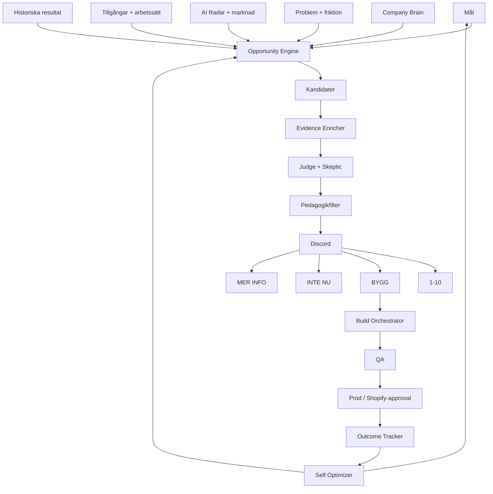
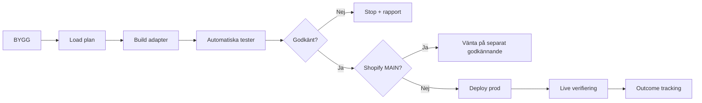

# Golfkuponger Opportunity OS — Design Spec

Datum: 2026-09-19  
Status: Design godkänd i chatten, implementation väntar på granskning av denna spec  
Primär ägare: Jonas  
Läsbehörighet i Discord: Jonas + Nicholas  
Beslutsbehörighet i Discord: endast Jonas

## 1. Syfte

Golfkuponger Opportunity OS ska kontinuerligt svara på:

> Vad är det bästa Golfkuponger kan göra härnäst för att nå sina mål?

Systemet ska inte vara en AI-nyhetsfeed. Det ska kombinera:

- Golfkupongers mål
- stabil företagskunskap
- befintliga tillgångar och system
- problem och friktion
- återkommande manuellt arbete
- historiska tester och resultat
- nya AI-modeller, skills, MCP:er, APIs, SaaS-verktyg och teknik
- marknads- och affärsmöjligheter

och producera ett mycket litet antal verifierade, pedagogiska och handlingsbara förslag.

## 2. Grundprinciper

1. Mål är överordnade problem. Problem är en signaltyp, inte systemets centrum.
2. AI får själv föreslå nya strategiska mål men Jonas måste aktivera dem.
3. När ett mål är aktivt får systemet autonomt skapa jaktområden, researcha, prioritera och lägga ned svaga spår.
4. AI Radar blir ett inputlager till Opportunity OS, inte slutprodukten.
5. Systemet ska generera många kandidater bakom kulisserna men visa få.
6. Business Value och Jonas Fit är separata signaler.
7. Jonas 1–10-rating får aldrig ändra objektiva affärspoäng.
8. Nicholas ska kunna förstå varje Discord-kort utan teknisk bakgrund.
9. Tekniska detaljer ska döljas bakom MER INFO.
10. BYGG betyder full implementation till produktion efter automatiska tester och verifiering.
11. Shopify MAIN är alltid undantaget: systemet får bygga och verifiera i experiment-site men får inte publicera MAIN utan separat Jonas-godkännande.
12. Irreversibla ändringar, okänd kostnad och saknade credentials ska fail-closed.
13. Systemet ska mäta utfallet efter genomförda byggbeslut och lära sig av verklig effekt.

## 3. Övergripande arkitektur

## 4. Målmotor

Tre nivåer:

### 4.1 Bolagsmål

Få och långlivade, exempel:

- öka omsättning
- öka lönsamhet
- skapa konkurrensfördel
- minska operativt beroende av manuellt arbete

### 4.2 Strategiska mål

Mer konkreta, exempel:

- hitta alternativa intäkter
- ha bästa möjliga hemsida
- förbättra appupplevelsen
- öka återköp
- öka partnerdistribution
- automatisera manuellt arbete
- minska kostnader och fel

### 4.3 Jaktområden

Skapas autonomt under aktiva mål.

Exempel under "bästa möjliga hemsida":

- mobil konvertering
- hastighet
- checkout-friktion
- visuell kvalitet
- SEO/AEO
- personalisering
- accessibility

### 4.4 Goal Strategist

Kör veckovis och ska:

- föreslå nya strategiska mål
- föreslå paus av mål som inte längre är relevanta
- upptäcka mål med för lite research
- skapa eller prioritera om jaktområden
- identifiera när ny teknik gör ett tidigare orealistiskt mål möjligt

Strategiska mål blir aldrig aktiva utan Jonas-beslut.

## 5. Opportunity Engine

Sex jaktmetoder kör parallellt.

### 5.1 Goal Hunter

Utgår från aktiva mål och söker nya sätt att nå dem.

### 5.2 Problem Solver

Utgår från verkliga problem och återkommande friktion i exempelvis support, Stripe, app, Shopify, n8n eller partnerarbete.

### 5.3 Asset Recombiner

Kombinerar tillgångar Golfkuponger redan har, exempelvis:

- kundbas
- klubbnätverk
- app
- företagskanal
- partnerrelationer
- Content Engine
- Shopify
- transaktionsdata
- internationella möjligheter
- n8n-automationer

Målet är att hitta nya erbjudanden och affärsmodeller utan att börja från noll.

### 5.4 Innovation Matcher

Nuvarande AI Radar fortsätter bevaka modeller, skills, MCP:er, APIs och verktyg, men fynden matchas mot Golfkupongers mål, tillgångar och arbetssätt innan de får bli en möjlighet.

### 5.5 Process Miner

Identifierar repetitivt mänskligt arbete och frågar varför det fortfarande kräver en människa.

### 5.6 Serendipity Engine

En begränsad del av researchbudgeten får generera oväntade kombinationer som inte följer ett känt problem eller en specifik extern nyhet.

## 6. Kunskapslager

Systemet ska arbeta med fem separata minnen.

### 6.1 Företagsminne

Källa: Company Brain.

Innehåller stabil operativ fakta om Golfkuponger.

### 6.2 Målminne

Aktiva och föreslagna mål samt jaktområden.

### 6.3 Opportunity-minne

Alla kandidater och beslut, även avvisade idéer.

Avvisade idéer tombstonas i stället för att raderas så att samma sak inte analyseras om utan materiell förändring.

### 6.4 Resultatminne

Vad som byggts och faktisk effekt efter deployment.

### 6.5 Preferensminne

Jonas 1–10-ratings och semantiska mönster.

Detta påverkar endast Jonas Fit/personal priority, inte objektivt Business Value.

## 7. Context Snapshot

Ett separat workflow ska hålla en kompakt strukturerad bild av Golfkuponger aktuell.

Det ska läsa förändringar från relevanta källor och uppdatera endast det som ändrats.

MVP-källor:

- Company Brain
- Growth System
- aktiv n8n-workflowinventering
- GitHub-repo och branchmetadata
- Content Engine
- apprepo
- Shopify experiment-site-status
- Clarity-sammanfattningar
- Stripe/ordermönster där data finns tillgänglig
- befintliga AI Radar-signaler

Rådata ska inte klistras in i varje prompt. Systemet ska välja endast relevant kontext för varje kandidat.

## 8. Data Tables

Nuvarande AI Radar-tabeller behålls för externa råsignaler och historik.

Nya tabeller:

### GK_OS_GOALS

- goal_id
- title
- level
- parent_goal_id
- status: PROPOSED / ACTIVE / PAUSED / RETIRED
- source: AI / JONAS
- rationale
- success_definition
- priority_score
- created_at
- last_reviewed_at
- activated_by
- activated_at

### GK_OS_HUNTS

- hunt_id
- goal_id
- title
- reason
- status
- research_weight
- query_strategy_json
- last_run_at
- next_run_at

### GK_OS_CONTEXT

- context_key
- context_type
- title
- summary
- source_ref
- content_hash
- verified_at
- updated_at

### GK_OS_OPPORTUNITIES

- opportunity_id
- title
- simple_summary
- why_now
- recommendation
- goal_ids_json
- origin_types_json
- evidence_json
- asset_links_json
- risks_json
- build_plan_json
- implementation_target
- business_value
- jonas_fit
- confidence
- effort_score
- cost_score
- reversibility_score
- decision_status
- discord_message_id
- created_at
- updated_at

### GK_OS_FEEDBACK

- opportunity_id
- jonas_rating
- discord_message_id
- interaction_id
- rated_at
- processed_at

### GK_OS_ACTIONS

- opportunity_id
- action: BUILD / NO / ACTIVATE_GOAL / PAUSE_GOAL
- user_id
- discord_message_id
- actioned_at
- processed_at

### GK_OS_OUTCOMES

- opportunity_id
- metric_name
- baseline
- expected_value
- measured_value
- measurement_window
- status
- measured_at
- notes

## 9. Research och verifiering

Kandidater ska gå genom flera steg.

### 9.1 Cheap generation

Gratis/billig modell används för bred generering och första filtrering.

### 9.2 Dedupe

Dubbletter, samma releasefamilj och små patchar grupperas innan mer AI-kostnad uppstår.

### 9.3 Evidence Enricher

Kör bara på lovande kandidater.

Ska verifiera:

- officiell dokumentation
- faktisk prissättning när relevant
- access och begränsningar
- integrationsmöjlighet
- relevant Golfkuponger-target
- om vi redan testat något liknande

### 9.4 Judge

Objektiv bedömning av affärsnytta.

### 9.5 Skeptic

Separat steg som aktivt försöker falsifiera idén:

- är antagandet fel?
- finns en enklare lösning?
- underskattas kostnaden?
- kräver detta mer arbete än det sparar?
- är detta bara tekniskt intressant utan affärsvärde?

Idéskaparen får inte ensam godkänna sin egen idé.

## 10. Prioritering

Objektivt Business Value ska baseras på:

- påverkan på aktiva mål
- ekonomisk potential
- time-to-value
- evidensstyrka
- implementation effort
- återkommande kostnad
- strategisk hävstång
- reversibilitet
- cross-goal leverage

Jonas Fit beräknas separat från 1–10-feedback.

En exceptionellt stark affärsmöjlighet får fortfarande publiceras även om Jonas Fit är lågt.

Systemet ska portföljbalansera så att inte alla fynd blir samma typ av automation.

## 11. Discord UX

Huvudkort: normalt 60–100 ord, absolut max cirka 140 ord.

Exempel:

> 💡 **Ny intäktsidé**
>
> **Låt företag köpa färdiga golfupplevelser**
>
> Golfkuponger har redan företagskunder och ett stort nätverk av golfanläggningar. Ny teknik gör det enklare att automatisera paketeringen och administrationen.
>
> **Varför intressant?**
> Kan skapa en ny intäkt utan att vi behöver bygga en helt ny verksamhet.
>
> **Mitt förslag:** bygg en enkel första version.
>
> Hur intressant? 1–10
>
> [ BYGG ] [ INTE NU ] [ MER INFO ]

För mål:

> 🎯 **Nytt mål**
>
> **Skapa en andra återkommande intäktskälla**
>
> ...
>
> [ AKTIVERA MÅL ] [ INTE NU ] [ MER INFO ]

### Behörighet

Nicholas:
- får läsa allt
- får inte påverka rating eller beslut

Jonas:
- enda användaren som får sätta 1–10
- enda användaren som får använda action-knappar

### Pedagogikfilter

Innan publicering måste ett separat steg skriva om texten för en person som arbetar på Golfkuponger men inte har byggt systemen.

Ord som MCP, webhook, orchestration, deployment, implementation target, embeddings och RAG ska inte synas i huvudkortet om de inte är absolut nödvändiga.

## 12. MER INFO

MER INFO ska visa:

1. vad idén faktiskt är
2. vilket mål den stödjer
3. varför den är intressant nu
4. vad Golfkuponger gör idag
5. exakt föreslagen förändring
6. evidens och källor
7. kostnad
8. tidsåtgång
9. risker
10. byggplan
11. teknisk implementation längst ner

Den ska använda lagrad analys och inte kräva en ny AI-körning.

## 13. Build Orchestrator

BYGG är ett explicit mandat från Jonas att genomföra idén hela vägen genom implementation, test, deployment och verifiering, med nedanstående undantag.

### Adapters

#### n8n

- skapa isolerad kopia eller ny workflowversion
- validera workflow
- testkör
- publicera först efter godkänd test
- verifiera exekvering
- rollback till tidigare version vid verifierat fel

#### GitHub / app / Content Engine

- skapa separat branch
- göra minimal implementation
- köra repoets tester/build
- skapa verifierbar diff
- deploya endast när automatiska kontroller passerar
- behålla rollback-ref

#### Railway

- deploya verifierad revision
- kontrollera health/logs
- rollback vid verifierat fel

#### Shopify

- ändra endast experiment-site automatiskt
- QA i experiment-site
- aldrig publicera eller ändra MAIN utan separat Jonas-godkännande

### Kostnad

BYGG ska endast kunna autoaktivera en ny extern betaltjänst om kostnaden var tydligt angiven i Discord-kortet och ligger under en konfigurerad autonom kostnadsgräns.

Okänd kostnad eller kostnad över gränsen stoppar före köp/aktivering och kräver Jonas-beslut.

## 14. Outcome Tracker

Varje byggd möjlighet ska ha en mätplan före deployment.

Exempel:

- tid sparad
- minskad felgrad
- ökad konvertering
- ökat återköp
- ny intäkt
- minskad kostnad
- kortare supporttid

Systemet mäter när datakälla finns, exempelvis efter 7 och 30 dagar.

Utfallet lagras som faktisk evidens och påverkar framtida prioritering.

## 15. Self Optimizer

En gång per vecka ska systemet analysera sin egen precision:

- hur många kandidater skapades?
- hur många nådde Discord?
- vilka fick 8–10?
- vilka byggdes?
- vilka gav faktisk effekt?
- vilka källor skapade mest brus?
- vilka jaktområden gav bäst resultat?
- vad kostade researchen?

Det får autonomt:

- sänka vikten på brusiga källor
- höja researchbudgeten för lovande mål
- ändra jaktområden
- ändra intern prioritering inom satta bounds

Det får inte:

- ändra aktiva strategiska mål utan Jonas
- ändra Business Value-formeln obegränsat
- låta Jonas Fit ersätta objektiv affärsbedömning

## 16. Workflow-familj

Befintliga 30–37 behålls initialt.

Föreslagen ny serie:

- 50 OS – Goal Strategist
- 51 OS – Context Snapshot
- 52 OS – Opportunity Generator
- 53 OS – Evidence Enricher
- 54 OS – Opportunity Judge
- 55 OS – Opportunity Publisher
- 56 OS – Discord Interactions
- 57 OS – Build Orchestrator
- 58 OS – Outcome Tracker
- 59 OS – Self Optimizer

Nuvarande AI Radar Collector/Screener fortsätter som signalgenerator. Nuvarande direkta AI Radar-publicering stängs först när Opportunity Publisher är verifierad.

## 17. Autonominivåer

### Får ske utan Jonas

- samla signaler
- uppdatera strukturerad kontext
- föreslå mål
- skapa jaktområden under aktiva mål
- generera kandidater
- researcha
- verifiera
- skapa säkra prototyper i isolerad miljö
- prioritera
- publicera pedagogiska förslag
- mäta resultat
- optimera researchbudget

### Kräver Jonas

- aktivera nytt strategiskt mål
- BYGG
- okänd eller för hög ny extern kostnad
- Shopify MAIN
- irreversibla förändringar utan säker rollback
- avtal eller extern affärsförpliktelse

## 18. Cost controls

- dedupe före AI
- cache på enrichments
- content hash för oförändrade källor
- gratis/billig modell i breda steg
- djupanalys endast på toppkandidater
- max researchbudget per mål
- max antal Discord-fynd per period
- inga nya AI-anrop för MER INFO
- tombstones för avvisade idéer
- återanalys endast vid materiell förändring

## 19. Migrering från nuvarande AI Radar

1. Behåll 30–37 oförändrade medan OS byggs.
2. Skapa nya OS-tabeller och workflows.
3. Låt befintliga AI Radar-fynd bli en av inputkällorna.
4. Kör Opportunity OS parallellt utan publicering.
5. QA mot historiska Radar-fynd och kända Golfkuponger-case.
6. Aktivera Opportunity Publisher.
7. Stäng direkt AI Radar-publicering när nya outputen är verifierad.
8. Behåll gamla data för lärande och recheck.

## 20. Acceptanskriterier

Systemet är klart när:

- AI kan föreslå strategiska mål som Jonas kan aktivera från Discord
- aktiva mål automatiskt genererar jaktområden
- Opportunity Engine kan skapa idéer från minst Goal Hunter, Problem Solver, Asset Recombiner och Innovation Matcher
- AI Radar-signaler inte längre behöver publiceras direkt
- en kandidat måste ha verifierad evidens innan hög prioritet
- Discord-korten kan förstås utan teknisk bakgrund
- Nicholas kan läsa allt men inte påverka systemet
- Jonas 1–10 fungerar och lärsystemet håller signalen separat från Business Value
- BYGG saknar TESTA-knapp
- BYGG startar automatiserad implementation
- Shopify MAIN blockeras alltid före publicering
- MER INFO använder lagrad analys
- outcome tracking kan mäta minst ett faktiskt resultat efter deployment
- systemet kan återuppliva en gammal idé när förutsättningarna materiellt ändrats
- systemet kan visa högst ett fåtal riktigt starka beslut i stället för en rå feed

## 21. Säkerhetsprincip

Opportunity OS ska vara autonomt i research, analys, prioritering och reversibel förimplementation.

Det ska vara konservativt vid pengar, externa åtaganden, irreversibel data och Shopify MAIN.

BYGG är Jonas explicita mandat för full implementation inom dessa ramar.
